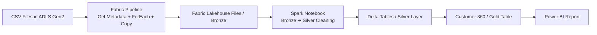

# 🛍 E-Commerce Analytics Platform — Microsoft Fabric | ADLS | Lakehouse | Power BI

This project demonstrates a **complete modern data engineering pipeline** using:

- Azure ADLS Gen2  
- Microsoft Fabric (Lakehouse + Notebooks + Pipelines)  
- Medallion Architecture (Bronze → Silver → Gold)  
- Power BI reporting  

---

## 📌 Business Goal

Create a **360-degree customer analytics platform** combining:

✔ Orders  
✔ Payments  
✔ Support tickets  
✔ Web engagement  
✔ Customer profile  

and deliver insights in **Power BI**.

---

## 🧭 Solution Architecture

## 📂 Repository Structure
ECOMMERCE_FABRIC_LAKEHOUSE/
├── docs/
│   └── architecture_diagram.png
├── notebooks/
│   └── bronze_silver_gold_notebook.ipynb
├── code.txt
├── DATASET.zip
└── README.md

🥇 Medallion Layers

🥇 Medallion Layers
🟤 Bronze — Raw Layer
Stored in: /Files/Bronze/

⚪ Silver — Clean Layer
Tables:
silver_customers
silver_orders
silver_payments
silver_support
silver_web

🟡 Gold — Analytics Layer
gold_customer360

🚀 How To Use

Upload CSV files to ADLS Gen2
Example: adls/ecommerce/raw/*.csv

Create a Fabric Workspace + Lakehouse
Name suggestion: ecommerce_lakehouse

Create a Fabric Pipeline
Get Metadata (list files)
ForEach (iterate)
Copy Data → /Files/Bronze/
Run the Notebook (Bronze → Silver → Gold)
Spark code is in code.txt.
Build a Power BI Report
Connect to gold_customer360

📊 Suggested Power BI Visuals

Sales by Date
Orders by Customer
Payments by Method
Support Issues Trend
Web Engagement Activity

🛠 Tech Stack

Azure ADLS Gen2
Microsoft Fabric
PySpark
Delta Tables
Power BI

🙌 Author
End-to-end demo project built for Microsoft Fabric Data Engineering learning & showcase.