# 🛍 E-Commerce Analytics Platform --- Microsoft Fabric \| ADLS \| Lakehouse \| Power BI

This project demonstrates a **modern data engineering pipeline** using:

-   Azure ADLS Gen2\
-   Microsoft Fabric (Lakehouse + Notebooks + Pipelines)\
-   Medallion Architecture (Bronze → Silver → Gold)\
-   Power BI

------------------------------------------------------------------------

## 📌 Business Goal

Create a **360-degree customer analytics platform** combining:

-   Orders\
-   Payments\
-   Support tickets\
-   Web engagement\
-   Customer profile

------------------------------------------------------------------------

## 🧭 Solution Architecture

``` mermaid
flowchart LR
    A[CSV Files in ADLS Gen2] --> B[Fabric Pipeline\nGet Metadata + ForEach + Copy]
    B --> C[Fabric Lakehouse Files / Bronze]
    C --> D[Spark Notebook\nBronze ➜ Silver Cleaning]
    D --> E[Delta Tables / Silver Layer]
    E --> F[Customer 360 / Gold Table]
    F --> G[Power BI Report]
```



------------------------------------------------------------------------

## 📂 Repository Structure

``` text
ECOMMERCE_FABRIC_LAKEHOUSE/
├── docs/
│   └── architecture_diagram.png
├── notebooks/
│   └── bronze_silver_gold_notebook.ipynb
├── code.txt
├── DATASET.zip
└── README.md
```

------------------------------------------------------------------------

## 🥇 Medallion Layers

### 🟤 Bronze --- Raw Layer

Stored in: `/Files/Bronze/`

### ⚪ Silver --- Clean Layer

Tables: - `silver_customers` - `silver_orders` - `silver_payments` -
`silver_support` - `silver_web`

### 🟡 Gold --- Analytics Layer

-   `gold_customer360`

------------------------------------------------------------------------

## 🚀 How To Use

1.  **Upload CSV files to ADLS Gen2**\
    Example: `adls/ecommerce/raw/*.csv`

2.  **Create a Fabric Workspace + Lakehouse**\
    Name suggestion: `ecommerce_lakehouse`

3.  **Create a Fabric Pipeline**

    -   Get Metadata (list files)
    -   ForEach (iterate)
    -   Copy Data → `/Files/Bronze/`

4.  **Run the Notebook (Bronze → Silver → Gold)**\
    Spark code is in `code.txt`.

5.  **Build a Power BI Report**

    -   Connect to `gold_customer360`

------------------------------------------------------------------------

## 📊 Suggested Power BI Visuals

-   Sales by Date\
-   Orders by Customer\
-   Payments by Method\
-   Support Issues Trend\
-   Web Engagement Activity

------------------------------------------------------------------------

## 🛠 Tech Stack

-   Azure ADLS Gen2\
-   Microsoft Fabric\
-   PySpark\
-   Delta Tables\
-   Power BI

------------------------------------------------------------------------

## 🙌 Author

Demo project for **Microsoft Fabric Data Engineering learning &
showcase**.
